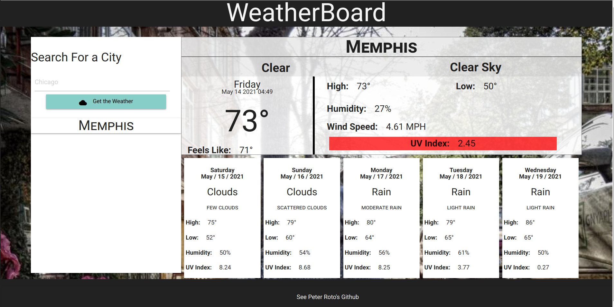
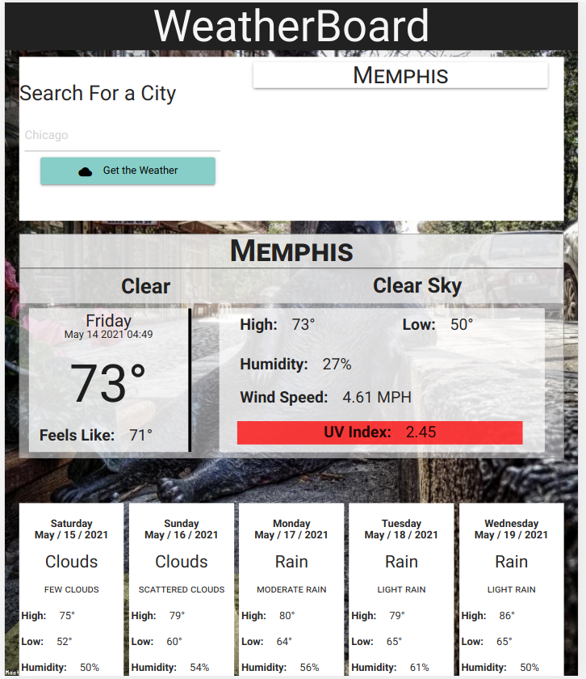
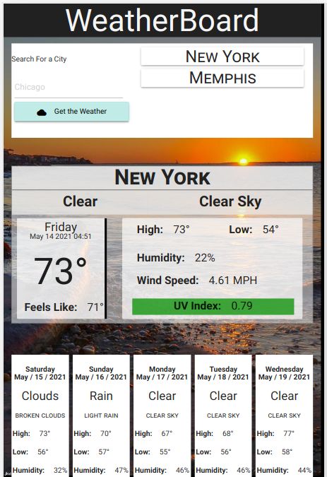
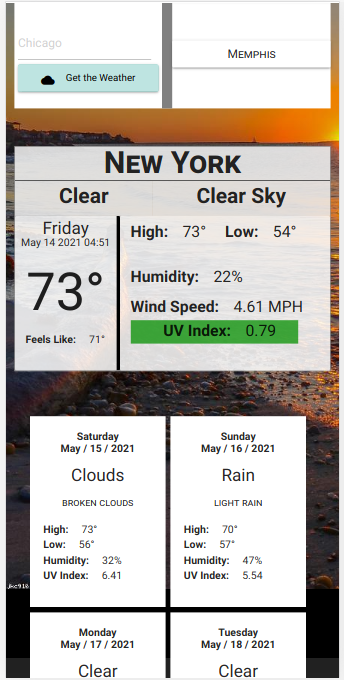

# WeatherBoard

## Application Summary

A simple multi-city weather dashboard that allows a user to quickly search for weather information about a city of their choice.  
This app will run in the browser and feature dynamically updated HTML and CSS powered by jQuery.

## Links and Screenshots

### Link to live application deployment information

[WeatherBoard Live Deployment](https://proto133.github.io/WeatherBoard/)

---

 

---

## Usage 

Usage is relatively intuitive. 

1. Simply click in the only input field on the page.
2. Type in your city that you'd like to look up.
3. Click, "Get the Weather" button.
4. Loose yourself in the magic of the interwebz! 
    
    - Notice the UV warning if you were planning on sunbathing!
    - Wanna go back to a city you just looked up, simply click on\
  it in the recent cities list and back you'll go!
    - The image in the background is generated by the weather\
   conditions in the city you looked up.\
   (ie "Clear Sky" searches for images of a "Clear Sky" and returns it to the background) :)

---

## Works Cited

- <a href="https://materializecss.com">Materialize Front-End Framework</a>

- <a href="https://fonts.google.com">Google Fonts</a>
- <a href="https://loremflickr.com/">LoremFlickr.com</a>
